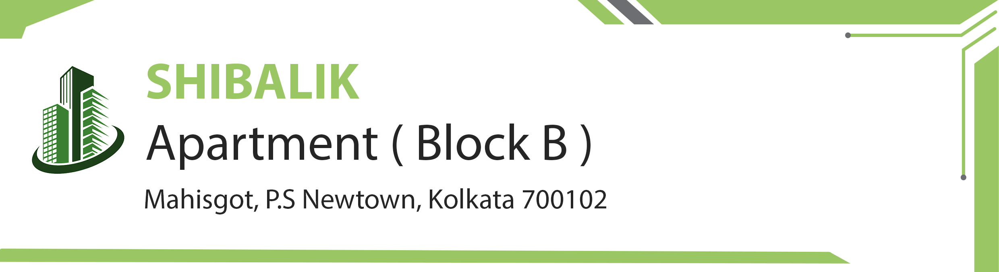

# Society Ledger

<p align="center">
  
</p>

<p align="center">
  A modern, simple, and efficient way to manage and display your society's important documents.
  <br />
  This project was built for personal use to serve the needs of my apartment community.
</p>

<p align="center">
  
  
  
  
</p>

## ✨ Features

-   **Public Document Viewer:** A clean and intuitive interface for residents to access meeting minutes and financial statements.
-   **Secure Editor Dashboard:** A password-protected area for administrators to easily upload and manage new documents.
-   **Modern UI/UX:** A beautiful, responsive design with a 2025-inspired aesthetic, featuring a light theme and rounded corners for a polished user experience.
-   **Optimized for Performance:** Built with the Next.js App Router and Server Components for fast page loads and a smooth, native-like feel.
-   **Automated Title Generation:** Document titles are automatically created from the selected date or period, simplifying the upload process for editors.

## 🚀 Tech Stack

-   **Framework:** [Next.js](https://nextjs.org/) (App Router)
-   **Language:** [TypeScript](https://www.typescriptlang.org/)
-   **Styling:** [Tailwind CSS](https://tailwindcss.com/)
-   **UI Components:** [ShadCN UI](https://ui.shadcn.com/)
-   **Icons:** [Lucide React](https://lucide.dev/)
-   **Authentication:** Secure, cookie-based sessions for the editor panel.
-   **Deployment:** Configured for seamless deployment on [Firebase App Hosting](https://firebase.google.com/docs/app-hosting).

## 🛠️ Getting Started

To get a local copy up and running, follow these simple steps.

### Prerequisites

-   Node.js (v18 or later recommended)
-   npm or yarn

### Installation & Setup

1.  **Clone the repository:**
    ```sh
    git clone https://github.com/your-username/your-repo-name.git
    cd your-repo-name
    ```

2.  **Install NPM packages:**
    ```sh
    npm install
    ```

3.  **Run the development server:**
    ```sh
    npm run dev
    ```

4.  **Open your browser:**
    Navigate to [http://localhost:9002](http://localhost:9002) to see the application in action.
    - The public viewer is at `/shibalik-b`.
    - The editor login is at `/shibalik-b/login`.

### Editor Credentials

To access the editor dashboard, use the credentials located in `src/data/credentials.ts`.

---

This project was a joy to build and serves a real need for my community. Enjoy!
